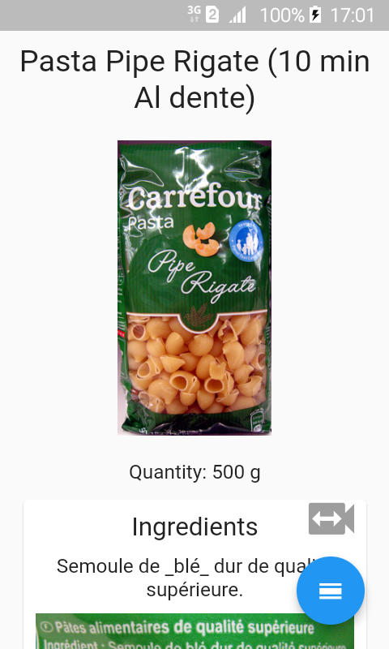

# Food scan

Scan a food product barcode and get detailled info about the product:

An [Android executable](https://github.com/synw/food_scan/releases/download/0.1.0/food_scan.apk) is available to install the app. Or compile it with Flutter.

Uses the [Openfood facts api](http://openfoodfacts.com/)

## Flutter libraries used

- [Flutter mobile vision](https://github.com/edufolly/flutter_mobile_vision): to scan barcodes
- [Dio](https://github.com/flutterchina/dio): advanced http client
- [Audioplayer](https://github.com/rxlabz/audioplayer): audio files player
- [Path provider](https://github.com/flutter/plugins/tree/master/packages/path_provider): utility module
- [Err](https://github.com/synw/err): error management